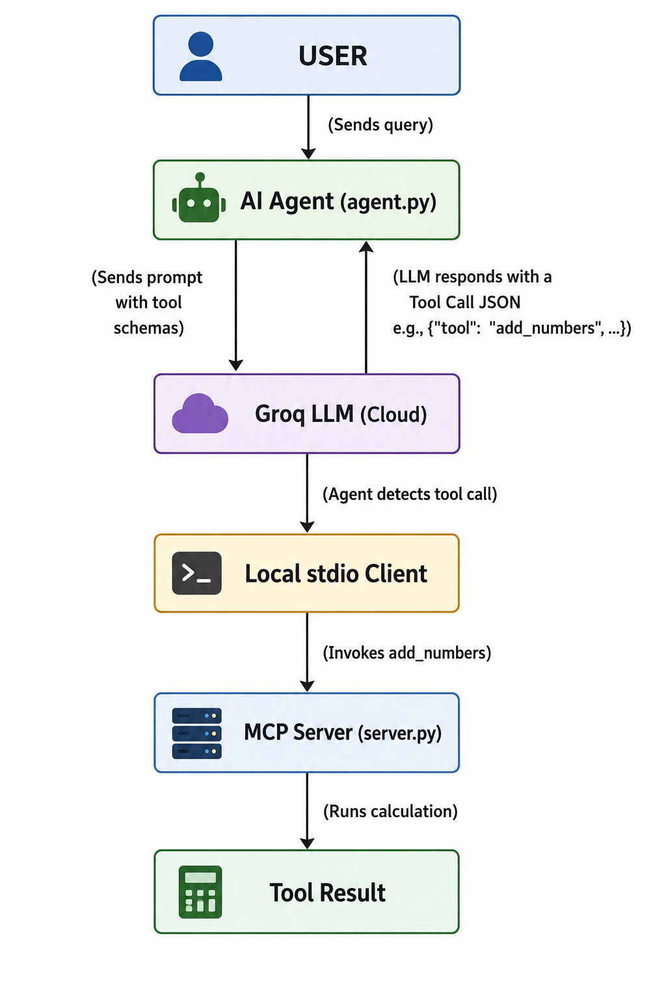

<div align="center">

<a href="https://github.com/mohd-faizy/fastmcp-server">
  
</a>

---


<p align="center">
  <strong>A beginner-friendly Model Context Protocol (MCP) server built with FastMCP, featuring an interactive Python AI Agent for tool discovery and integration.</strong>
</p>

<!-- update -->
<p align="center">
  <a href="https://github.com/jlowin/fastmcp"></a>
  <a href="https://python.org/"></a>
  <a href="https://www.docker.com/"></a>
</p>

<!-- update -->
<p align="center">
  <a href="https://github.com/mohd-faizy/fastmcp-server/stargazers"></a>
  <a href="https://github.com/mohd-faizy/fastmcp-server/issues"></a>
  <a href="https://github.com/mohd-faizy/fastmcp-server/commits/main"></a>
  <a href="https://github.com/mohd-faizy/fastmcp-server"></a>
</p>

<!-- Meta & Community -->
<p align="center">
  <a href="https://github.com/mohd-faizy"></a>
  <a href="https://github.com/mohd-faizy/fastmcp-server"></a>
  <a href="https://github.com/mohd-faizy/fastmcp-server/blob/main/LICENSE"></a>
  <a href="https://github.com/mohd-faizy/fastmcp-server/pulls"></a>
</p>

</div>

A beginner-friendly Model Context Protocol (MCP) server built with [FastMCP](https://github.com/jlowin/fastmcp), along with an interactive Python AI Agent (`agent.py`) that showcases how agents connect to and utilize MCP tools. This repository is designed to serve as a complete, clear, and step-by-step learning guide for developers building their first MCP integrations.


## 🏗️ Architecture & How It Works

This project contains two primary components:
1. **MCP Server (`server.py`)**: Defines utility tools, resources, and prompt templates.
2. **AI Agent (`agent.py`)**: An interactive command-line LLM client that launches the server, discovers its tools, and calls them dynamically based on user prompts.

Here is the big picture of how they communicate:

<p align="center">
  
</p>

---

## 📖 Core MCP Primitives

Model Context Protocol (MCP) defines three main building blocks to extend LLM capabilities:

| Primitive | Description | Analogy | Example in Server |
| :--- | :--- | :--- | :--- |
| 🔧 **Tool** | A function the AI can *call* to perform actions or computations | A calculator button | `add_numbers`, `count_words`, `calculator` |
| 📚 **Resource** | Static or dynamic data the AI can *read* for context | A reference guide | `resource://server-info`, `resource://learning-tips` |
| 💬 **Prompt** | A reusable instruction *template* designed to guide LLM style | A standardized form | `explain_concept`, `code_review` |

---

## ✨ Inside the Server (`server.py`)

The server is kept clean and minimal, implementing the following primitives:

### 🔧 Tools
- `add_numbers(a, b)`: Adds two float values and returns a string response.
- `get_current_time()`: Returns the current UTC time formatted nicely.
- `count_words(text)`: Performs simple text statistics (word count, total chars, non-space chars).
- `reverse_text(text)`: Reverses the input string's characters.
- `random_number(min_val, max_val)`: Safely selects a random integer in the range.
- `calculator(expression)`: Safely evaluates simple math expressions (supporting `sqrt`, `abs`, `round`, `pow`, `pi`, `e`).
- `make_greeting(name, style)`: Builds a personalized greeting (supporting `formal`, `casual`, `enthusiastic`).

### 📚 Resources
- `resource://server-info`: Provides a markdown table of server tools, resources, and prompts.
- `resource://learning-tips`: Contains a detailed list of tips and design principles for building MCP servers.

### 💬 Prompts
- `explain_concept(concept, level)`: Returns a structured request asking the LLM to explain a concept with varying detail depending on the level (beginner, intermediate, advanced).
- `code_review(code, language)`: Returns a structured request formatting a code snippet and asking the LLM to review correctness, readability, best practices, and bugs.

---

## 🛠️ Getting Started & Setup

### 1. Prerequisites
- **Python 3.10+** (verify with `python --version`)
- **pip** (verify with `pip --version`)
- **Groq API Key** (Get one for free at the [Groq Console](https://console.groq.com/))
- *(Optional)* [Claude Desktop](https://claude.ai/download) for testing the server directly in a client UI

### 2. Installation
Clone the repository:
```bash
git clone https://github.com/mohd-faizy/fastmcp-server.git
cd fastmcp-server
```

Choose one of the virtual environment options below:

#### Option A: Using `uv` (Recommended / Fastest)
```bash
# Create and sync the virtual environment:
uv venv
uv pip install -r requirements.txt
```

#### Option B: Using standard `venv`
```bash
# Create the environment
python -m venv .venv

# Activate it:
source .venv/bin/activate      # macOS / Linux
.venv\Scripts\activate         # Windows (Command Prompt)
.venv\Scripts\Activate.ps1     # Windows (PowerShell)

# Install dependencies:
pip install -r requirements.txt
```

### 3. Environment Configuration
Copy the environment example file and fill in your Groq API key:
```bash
cp .env.example .env
```
Open `.env` and configure:
```env
GROQ_API_KEY="your-actual-groq-api-key-here"
GROQ_MODEL="llama-3.1-8b-instant"  # Optional: defaults to llama-3.1-8b-instant
```

---

## 🖥️ Running the MCP Server (`server.py`)

The server supports two transport modes: **stdio** (standard input/output, local) and **SSE** (Server-Sent Events, remote over HTTP).

### 1. Running Locally (stdio)
By default, the server runs in `stdio` mode. This is the mode used by Claude Desktop and local agent connections.
```bash
python server.py --transport stdio
# or simply:
python server.py
```
You will see:
```
📡 Starting MCP server (stdio) — waiting for client connection …
```

### 2. Running Remotely (SSE)
To run the server as an HTTP service listening on a specific port (allowing remote clients to connect):
```bash
python server.py --transport sse --port 8000 --host 0.0.0.0
```
You will see:
```
🌐 Starting MCP server (SSE) → http://0.0.0.0:8000
   Connect your client to: http://<your-ip>:8000/sse
```

Supported flags and env variable overrides:
| Flag | Env Var | Default | Description |
| :--- | :--- | :--- | :--- |
| `--transport` | `MCP_TRANSPORT` | `stdio` | Transport type: `stdio` or `sse` |
| `--host` | `MCP_HOST` | `0.0.0.0` | Bind IP address in SSE mode |
| `--port` | `MCP_PORT` | `8000` | Bind port in SSE mode |

---

## 🧪 Testing & Connecting

### 1. Testing with the MCP Inspector
FastMCP comes with a developer inspector that lets you test your tools instantly in a web playground:
```bash
# Launch using FastMCP CLI
fastmcp dev inspector server.py
```
When the command runs, a web browser will automatically open with the MCP Inspector. Here is how to use it:
- **Explore Tools**: On the left sidebar, click on "Tools" to see all the functions available (like `add_numbers` or `get_current_time`).
- **Test a Tool**: Click on a specific tool, enter some test values into the input boxes, and click the "Run Tool" button.
- **View Results**: The right panel will instantly show the exact JSON response your server returned, helping you verify that your tool works perfectly without writing any AI agent code!

### 2. Connecting to Claude Desktop
To test the server using Claude Desktop:
1. Open Claude Desktop's configuration file:
   - **macOS**: `~/Library/Application Support/Claude/claude_desktop_config.json`
   - **Windows**: `%APPDATA%\Claude\claude_desktop_config.json`
2. Add your server configuration under the `mcpServers` object:
   ```json
   {
     "mcpServers": {
        "fastmcp-server": {
          "command": "C:\\Users\\yourname\\projects\\fastmcp-server\\.venv\\Scripts\\python.exe",
          "args": ["C:\\Users\\yourname\\projects\\fastmcp-server\\server.py"]
        }
      }
    }
    ```
    *(Note: Ensure paths are absolute, and use double backslashes on Windows).*
3. Restart Claude Desktop. The plug icon will appear, indicating that your tools are successfully connected!
4. **Click the Plug Icon**: You will see a list of all your tools loaded directly from `fastmcp-server`.
5. **Prompt Claude**: Start a new chat and simply ask Claude to use one of the tools (e.g., *"Use the add_numbers tool to add 150.5 and 300.2"*). Claude will now seamlessly execute your local Python code and give you the answer!

---

## 🤖 Running the AI Agent (`agent.py`)

The repository includes a ready-to-run AI agent (`agent.py`) that demonstrates programmatic MCP tool usage. 

### How the Agent Works:
1. **Spawns Server Subprocess**: The agent launches `server.py` locally in a subprocess using Python's executable and standard input/output (`stdio`).
2. **Tool Discovery**: It fetches the list of all available tools (`add_numbers`, `calculator`, etc.) exposed by the server.
3. **Conversational Loop**: It prompts you for input. When you enter a question (e.g., "What is the square root of 144?"):
   - It formats a prompt containing the schemas of all discovered tools.
   - It sends the request to Groq LLM.
   - If the LLM determines a tool is needed, it returns a structured JSON tool call (e.g. `{"tool": "calculator", "args": {"expression": "sqrt(144)"}}`).
   - The agent catches this request, invokes the tool on the running MCP server session, obtains the string result, and displays it to you.
   - If no tool is needed, the LLM answers in plain text.

### To Run:
Make sure your `.env` contains your `GROQ_API_KEY`, then run:
```bash
python agent.py
```

Example session:
```
[Agent] Starting MCP server …
✅ Connected – 7 tools discovered.
You: add 15 and 28
🔧 Calling tool 'add_numbers' with {'a': 15, 'b': 28}
✅ Tool result: 15.0 + 28.0 = 43.0
You: who is the president of France?
🤖 Answer: The President of France is Emmanuel Macron.
You: exit
Goodbye!
```

---

## 🐳 Containerization with Docker

This repository is fully containerized. You can run the server in SSE mode inside a Docker container.

### 1. Dockerfile Step-by-Step Breakdown
The server's [Dockerfile](file:///c:/Users/mohdf/OneDrive/Desktop/fastmcp-server/Dockerfile) is defined step-by-step as follows:
- **Step 1 (Base Image)**: Starts with `python:3.11-slim` to keep the container lightweight.
- **Step 2 (Work Directory)**: Sets `/app` as the working directory inside the container.
- **Step 3 (Copy Requirements)**: Copies `requirements.txt` to the work directory first (leveraging Docker layer caching).
- **Step 4 (Install Dependencies)**: Runs `pip install --no-cache-dir -r requirements.txt` to install fastmcp, dotenv, groq, etc.
- **Step 5 (Copy Server Code)**: Copies the server script `server.py` into the container.
- **Step 6 (Set Environment Variables)**: Configures default runtime environment variables:
  - `MCP_TRANSPORT=sse`
  - `MCP_HOST=0.0.0.0`
  - `MCP_PORT=8000`
- **Step 7 (Expose Port)**: Exposes port `8000` to bind to the host.
- **Step 8 (Run the Server)**: Triggers `CMD ["python", "server.py"]` to start the server.

### 2. End-to-End: Build, Test, and Push to Docker Hub

This guide will walk you through building your server into a Docker image, verifying it runs locally, and pushing it to your Docker Hub registry so it can be deployed anywhere.

#### Step 1: Build the Image Locally
First, build the Docker image and tag it with your Docker Hub username.
```bash
docker build -t mohd-faizy/fastmcp-server:latest .
```
*(Note: The `.` at the end tells Docker to use the `Dockerfile` in the current directory).*

#### Step 2: Test the Container Locally (Optional but Recommended)
Before pushing the image online, ensure it runs correctly on your machine.
```bash
docker run -d -p 8000:8000 --name mcp-server mohd-faizy/fastmcp-server:latest
```
- `-d`: Runs the container in the background (detached mode).
- `-p 8000:8000`: Maps port 8000 on your machine to port 8000 inside the container.
- `--name mcp-server`: Gives the running container a friendly name.

To verify it is running, view the logs:
```bash
docker logs mcp-server
```
*(Once you are done testing, you can stop and remove it using `docker rm -f mcp-server`).*

#### Step 3: Generate a Docker Hub Access Token
To push an image to Docker Hub, you must authenticate. Instead of using your account password, Docker requires a **Personal Access Token (PAT)** for better security.

1. Go to [Docker Hub Security Settings](https://hub.docker.com/settings/security).
2. Click **New Access Token**.
3. Give it a description (e.g., "fastmcp-server-push").
4. ⚠️ **CRITICAL STEP**: Under **Access permissions**, change the dropdown from *Read-only* to **Read & Write**. If you leave it as Read-only, you will get an `insufficient scopes` error when you try to push!
5. Click **Generate** and copy the token (it will look like `dckr_pat_...`).

#### Step 4: Log in to Docker Hub
Authenticate your terminal session using the token. 

**Standard Method:**
```bash
docker login -u mohd-faizy
```
When it asks for your `Password:`, **Right-click once** (or press Ctrl+V) to paste the token. 
*Note: In Windows terminals, the cursor will NOT move and no characters or stars will appear when you paste passwords. This is a security feature. Just paste it blindly and press **Enter**.*

**Alternative PowerShell Method:**
If you prefer not to deal with the invisible password prompt, you can use the PowerShell pipeline to securely pass the token directly to the command:
```powershell
"YOUR_NEW_TOKEN_HERE" | docker login -u mohd-faizy --password-stdin
```

If successful, you will see `Login Succeeded`.

#### Step 5: Push the Image to Docker Hub
Now that you are authenticated with Write permissions, push your tagged image up to the cloud.

```bash
docker push mohd-faizy/fastmcp-server:latest
```
*(Note: Docker Hub's website sometimes shows a generic command like `docker push mohd-faizy/fastmcp-server:tagname`. You must replace `:tagname` with your actual tag, which in this case is `:latest`).*

Once finished, your image is live and ready to be pulled by any machine anywhere in the world using `docker pull mohd-faizy/fastmcp-server:latest`!

---

### 2. Docker Compose Step-by-Step Breakdown
For simplified deployment and service management, [docker-compose.yml](file:///c:/Users/mohdf/OneDrive/Desktop/fastmcp-server/docker-compose.yml) is structured as follows:
- **Step 1 (Build Command)**: Starts build via `docker compose up --build`.
- **Step 2 (Stop Command)**: Stops services via `docker compose down`.
- **Step 3 (Services Block)**: Defines the containers to manage.
- **Step 4 (mcp-server Service)**: Declares our container service.
- **Step 5 (Build Context)**: Sets `build: .` to build using the local Dockerfile.
- **Step 6 (Image Tag)**: Sets the built image tag name (`mohd-faizy/fastmcp-server:latest`).
- **Step 7 & 8 (Port Mapping)**: Maps port `8000` from host to container (`"8000:8000"`).
- **Step 9, 10, 11 & 12 (Environment Config)**: Passes environment variables to set the SSE transport type (`sse`), host (`0.0.0.0`), and port (`8000`).
- **Step 13 (Restart Policy)**: Sets `restart: unless-stopped` to automatically restart the container on unexpected crashes or machine reboots.

#### Commands to Build and Run Compose:
```bash
# Build and launch the container in the background
docker compose up -d --build

# Stop the container and remove networks/resources
docker compose down
```

---

## 📁 Project Structure

```
fastmcp-server/
├── .env.example        ← Copy to .env and fill in your values
├── .gitignore          ← Files that stay out of git
├── Dockerfile          ← Container image definition (SSE mode)
├── README.md           ← This file (complete guide)
├── agent.py            ← Interactive Python AI client (stdio)
├── docker-compose.yml  ← Easy container orchestration
├── requirements.txt    ← Python dependencies
└── server.py           ← The FastMCP server script
```

---

## 🧩 How to Add Your Own Tool

Open `server.py` and add a decorated function anywhere in the **Tools** section:

```python
@mcp.tool()
def my_new_tool(input_text: str, repeat: int = 1) -> str:
    """
    A brand-new tool that repeats text.

    Args:
        input_text: The text to repeat.
        repeat:     How many times to repeat it (default: 1).
    """
    return (input_text + " ") * repeat
```

That's it — restart the server/agent, and the new tool is immediately discovered and usable!

**Key Rules for Custom Tools:**
1. **Add a Docstring**: The LLM reads it to understand what the tool does and when to call it.
2. **Type Annotations**: Always annotate all parameters with Python types (`str`, `int`, `float`, `bool`, etc.). FastMCP uses this to automatically build the JSON schema definitions for the LLM.
3. **Return Value**: Always return a `str` or a JSON-serializable object.
4. **Error Handling**: Catch exceptions internally and return user-friendly error strings rather than crashing the server.

---

## 🤔 Frequently Asked Questions

- **What is the difference between stdio and SSE?**  
  `stdio` runs the server as a local subprocess using stdin/stdout. `sse` runs it as an HTTP service with Server‑Sent Events for remote clients.

- **Can I use other LLM providers (OpenAI, Anthropic, etc.)?**  
  Yes. FastMCP follows open standards; swap the Groq SDK in `agent.py` for any provider’s SDK.

- **Why doesn’t Claude Desktop show my tools?**  
  • Ensure absolute paths in the `mcpServers` config.  
  • Verify Python and FastMCP are installed.  
  • Restart Claude Desktop after changes.

- **Is the tool safe to expose publicly?**  
  It uses a restricted `eval` sandbox – fine for learning, but use a dedicated math parser (e.g., `simpleeval`) for production.

- **How do I add a custom tool?**  
  Decorate a function with `@mcp.tool()`, add a docstring, and restart the server.

- **How can I rebuild and push the Docker image?**  
  ```bash
  docker build -t mohd-faizy/fastmcp-server:latest .
  docker push mohd-faizy/fastmcp-server:latest
  ```
---

## 📚 Learn More

| Resource | Link |
| :--- | :--- |
| **FastMCP GitHub** | [FastMCP Repository](https://github.com/jlowin/fastmcp) |
| **Model Context Protocol** | [Official Specification](https://modelcontextprotocol.io) |
| **Claude Desktop Developer Guide** | [Claude Desktop Documentation](https://claude.ai/download) |
| **MCP Python SDK** | [Python Client/Server SDK](https://github.com/modelcontextprotocol/python-sdk) |

---

## ⚖️ License

This project is licensed under the MIT License - see the [LICENSE](LICENSE) file for details

---

## 🔗 Connect with me

<div align="center">

[](https://twitter.com/F4izy)
[](https://www.linkedin.com/in/mohd-faizy/)
[](https://ai.stackexchange.com/users/36737/faizy)
[](https://github.com/mohd-faizy)

</div>